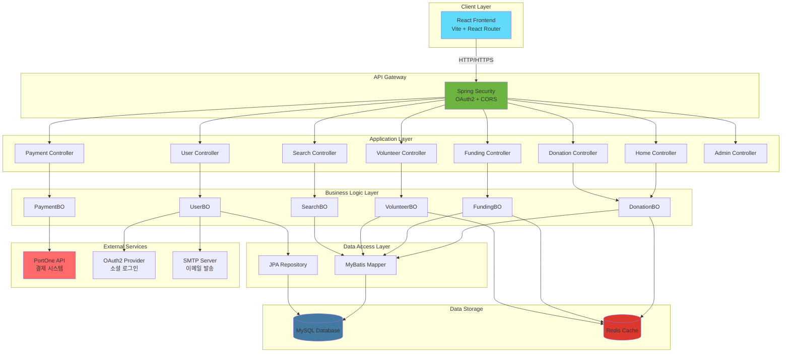
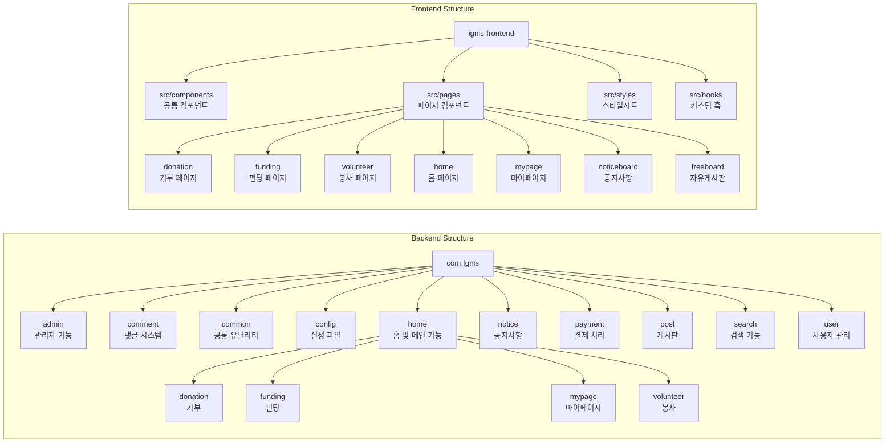
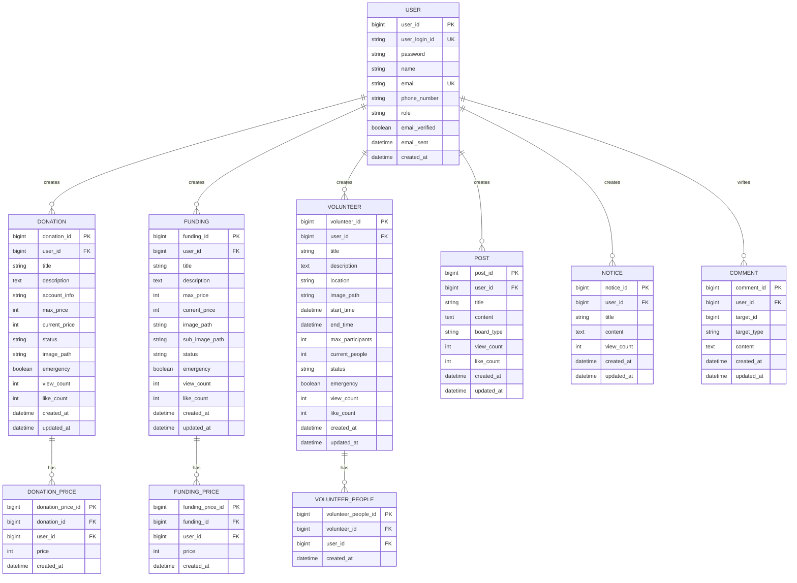
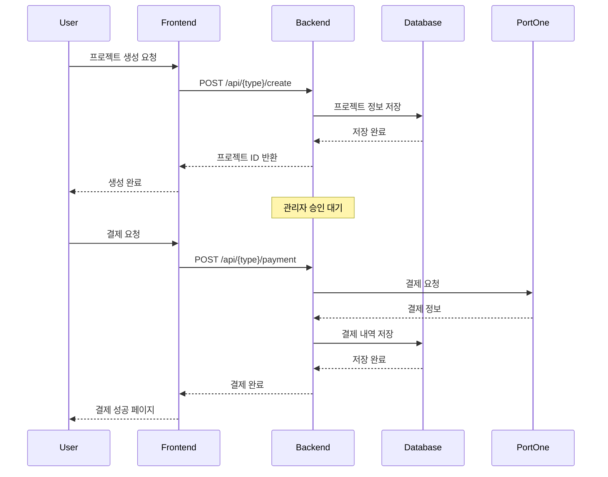
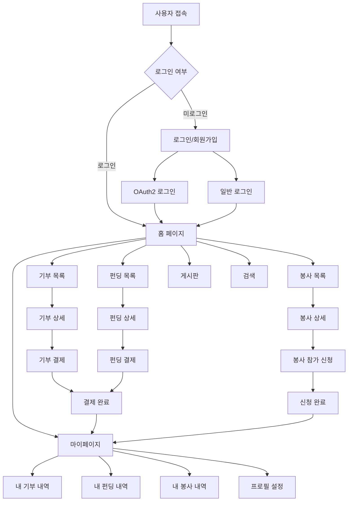

# 🔥 Ignis - 사회적 가치 실현 플랫폼

Ignis는 기부, 펀딩, 봉사 활동을 통합한 사회적 가치 실현 플랫폼입니다. 사용자들이 다양한 사회 공헌 활동에 참여하고, 커뮤니티를 형성하며, 긍정적인 변화를 만들어갈 수 있도록 지원합니다.

## 📋 목차

- [주요 기능](#주요-기능)
- [기술 스택](#기술-스택)
- [시스템 아키텍처](#시스템-아키텍처)
- [프로젝트 구조](#프로젝트-구조)
- [데이터베이스 구조](#데이터베이스-구조)
- [설치 및 실행](#설치-및-실행)
- [API 엔드포인트](#api-엔드포인트)
- [프로젝트 워크플로우](#프로젝트-워크플로우)
- [보안 기능](#보안-기능)
- [기여하기](#기여하기)

## ✨ 주요 기능

### 1. **기부 (Donation)**
- 기부 프로젝트 등록 및 관리
- 실시간 기부 현황 추적
- 긴급 기부 프로젝트 지원
- 기부 내역 조회 및 관리

### 2. **펀딩 (Funding)**
- 크라우드펀딩 프로젝트 생성
- 리워드 선택 및 결제 시스템
- 펀딩 목표 달성률 추적
- 긴급 펀딩 프로젝트 지원

### 3. **봉사 (Volunteer)**
- 봉사 활동 등록 및 신청
- 참가자 관리 시스템
- 봉사 일정 및 위치 관리
- 긴급 봉사 활동 지원

### 4. **커뮤니티**
- 공지사항 게시판
- 자유게시판
- 댓글 시스템
- 좋아요 및 조회수 기능

### 5. **사용자 관리**
- OAuth2 소셜 로그인
- 회원가입 및 인증
- 마이페이지 (대시보드, 프로필 설정)
- 비밀번호 찾기 (이메일 인증)

### 6. **검색 및 추천**
- 통합 검색 기능
- 카테고리별 검색
- 인기 프로젝트 추천
- 조회수 기반 추천

### 7. **결제 시스템**
- PortOne(Iamport) 결제 연동
- 기부 및 펀딩 결제 처리
- 결제 내역 관리

### 8. **관리자 기능**
- 프로젝트 승인/거부
- 사용자 관리
- 통계 및 대시보드

## 🛠 기술 스택

### Backend
- **Java 17**
- **Spring Boot 3.4.4**
- **Spring Security** (OAuth2 클라이언트)
- **MyBatis 3.0.4**
- **Spring Data JPA**
- **MySQL 8.0**
- **Redis** (캐싱)
- **Spring Mail** (이메일 인증)
- **PortOne API** (결제 시스템)

### Frontend
- **React 19.1.0**
- **Vite 7.0.0**
- **React Router DOM 7.9.6**
- **Ant Design 5.26.3**
- **jQuery 3.7.1**

### Build Tools
- **Gradle** (Backend)
- **npm** (Frontend)

## 🏗 시스템 아키텍처



## 📁 프로젝트 구조



## 🗄 데이터베이스 구조



## 🚀 설치 및 실행

### 사전 요구사항
- Java 17 이상
- Node.js 18 이상
- MySQL 8.0 이상
- Redis (선택사항)

### Backend 설정

1. **프로젝트 클론**
```bash
git clone <repository-url>
cd ignis1
```

2. **데이터베이스 설정**
   - MySQL 데이터베이스 생성
   - `application.properties` 또는 `application.yml` 파일에 데이터베이스 연결 정보 설정

3. **의존성 설치 및 실행**
```bash
# Gradle Wrapper를 사용하여 실행
./gradlew bootRun

# Windows의 경우
gradlew.bat bootRun
```

### Frontend 설정

1. **프론트엔드 디렉토리로 이동**
```bash
cd ignis-frontend
```

2. **의존성 설치**
```bash
npm install
npm i @ant-design/compatible
npm i react-router-dom
```

3. **개발 서버 실행**
```bash
npm run dev
```

### 프로덕션 빌드

**Frontend 빌드**
```bash
cd ignis-frontend
npm run build
```

빌드된 파일은 `src/main/resources/static` 디렉토리에 자동으로 복사됩니다.

## 📡 API 엔드포인트

### 인증 관련
- `GET /user/me` - 현재 사용자 정보 조회
- `POST /user/signup` - 회원가입
- `POST /user/login` - 로그인
- `POST /user/logout` - 로그아웃
- `GET /oauth2/authorization/{provider}` - OAuth2 로그인

### 기부 관련
- `GET /api/donation/list` - 기부 목록 조회
- `GET /api/donation/{id}` - 기부 상세 조회
- `POST /api/donation/create` - 기부 프로젝트 생성
- `POST /api/donation/payment` - 기부 결제

### 펀딩 관련
- `GET /api/funding/list` - 펀딩 목록 조회
- `GET /api/funding/{id}` - 펀딩 상세 조회
- `POST /api/funding/create` - 펀딩 프로젝트 생성
- `POST /api/funding/payment` - 펀딩 결제

### 봉사 관련
- `GET /api/volunteer/list` - 봉사 목록 조회
- `GET /api/volunteer/{id}` - 봉사 상세 조회
- `POST /api/volunteer/create` - 봉사 활동 생성
- `POST /api/volunteer/{id}/participate` - 봉사 참가

### 검색 관련
- `GET /api/search?keyword={keyword}&type={type}` - 통합 검색

### 홈 관련
- `GET /api/home` - 홈 페이지 데이터 조회
- `GET /api/emergency/check` - 긴급 공지 확인

## 🔄 프로젝트 워크플로우



## 🔐 보안 기능

- Spring Security를 통한 인증/인가
- OAuth2 소셜 로그인 지원
- 비밀번호 SHA-256 해싱
- CORS 설정
- CSRF 보호
- 세션 관리

## 📊 주요 기능 흐름도



## 🤝 기여하기

1. Fork the Project
2. Create your Feature Branch (`git checkout -b feature/AmazingFeature`)
3. Commit your Changes (`git commit -m 'Add some AmazingFeature'`)
4. Push to the Branch (`git push origin feature/AmazingFeature`)
5. Open a Pull Request

## 📝 라이선스

이 프로젝트는 MIT 라이선스를 따릅니다.

## 👥 팀

- 개발팀: Ignis Development Team

## 📞 문의

프로젝트 관련 문의사항이 있으시면 이슈를 등록해주세요.

---

**Ignis** - 함께 만드는 따뜻한 세상 🔥
